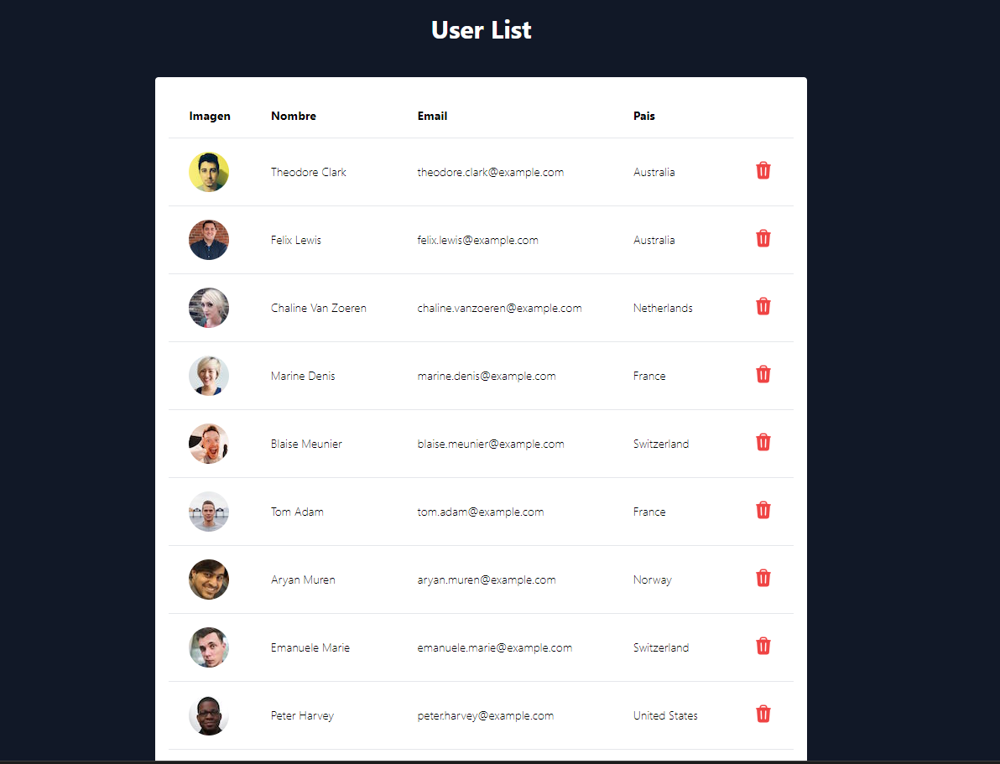

# React + Vite - Users List App

This app is a simple user management, developed using React and Recoil for state management.
The app allows you to load users from [Random User](https://randomuser.me/) API, display the fetched users in a table, also you can delete them.

## Getting Started
### Prerequisites
To run this project you will need:
* Node.js
* npm
* React
* Recoil

### Installation
To set up and run the project:
1) Clone the repository

```shell
git clone https://github.com/roninJosue/users-app.git
```

2) Navigate into the project directory
```shell
cd users-app
```
3) Install the dependencies
```shell
npm install
```
4) Start the project
```
npm run dev
```
### Usage
The App show a table with 100 users fetched, it show image, name, email, country and a button for delete that user.

